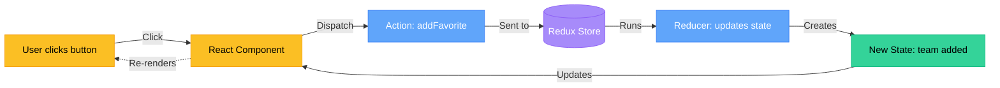
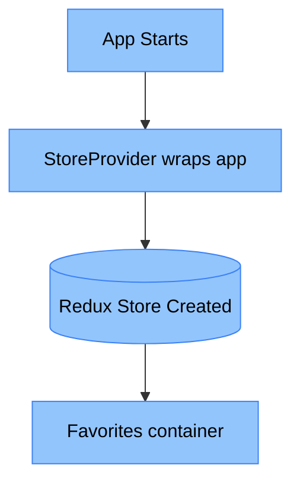

# Redux Architecture - Game2EZ

## Overview

This diagram visualizes the Redux Toolkit architecture using the Store Factory pattern optimized for Next.js 15 App Router.

## Architecture Diagram



## Simple Explanation

Think of Redux like a simple loop:

1. **User clicks** a button (add to favorites)
2. **Component sends** a message called "addFavorite"
3. **Redux Store receives** the message
4. **Reducer changes** the state (adds team to favorites)
5. **New state created** (favorites list updated)
6. **Component gets updated** automatically
7. **Screen re-renders** with updated favorites

### Setup (How it starts)



**What's in the store:**
- **Favorites container**: Stores which teams you liked

## Redux Flow in Your App

### 1. Initialization (App Startup)
```
App Start → StoreProvider renders → makeStore() called →
configureStore creates Redux store → loads favorites reducer
```

### 2. Reading State (Component → State)
```
Component imports useAppSelector →
calls selector (e.g., selectFavorites) →
reads from RootState → component renders
```

### 3. Updating State (Component → Action → Reducer → State)
```
User interaction → Component calls useAppDispatch →
dispatch(action) (e.g., addFavorite()) →
reducer updates state (Immer handles immutability) →
side effect writes to localStorage →
components re-render with new state
```

### 4. Type Safety (TypeScript)
```
Store types inferred → RootState, AppDispatch, AppStore exported →
typed hooks created with .withTypes<T>() →
full autocomplete & type checking in components
```

## Key Files

| File | Purpose |
|------|---------|
| `lib/store/store.ts` | Store factory + type exports |
| `lib/store/features/favorites/favoritesSlice.ts` | Favorites state management |
| `lib/hooks/hooks.ts` | Typed Redux hooks |
| `app/StoreProvider.tsx` | Redux Provider wrapper |

## Design Patterns

1. **Store Factory Pattern**: Required for Next.js App Router - creates new store per request/client
2. **Slice Pattern**: Encapsulates related state, reducers, and actions in single file
3. **Typed Hooks Pattern**: Pre-configured hooks with TypeScript types for DX
4. **Selector Pattern**: Memoized state readers for efficient re-renders
5. **Side Effect Pattern**: Reducers handle localStorage sync directly (simple use case)

## References

- [Redux Essentials Tutorial](https://redux.js.org/tutorials/essentials/part-1-overview-concepts)
- [Redux Toolkit with Next.js](https://redux-toolkit.js.org/usage/nextjs)
- [TypeScript Quick Start](https://react-redux.js.org/tutorials/typescript-quick-start)
